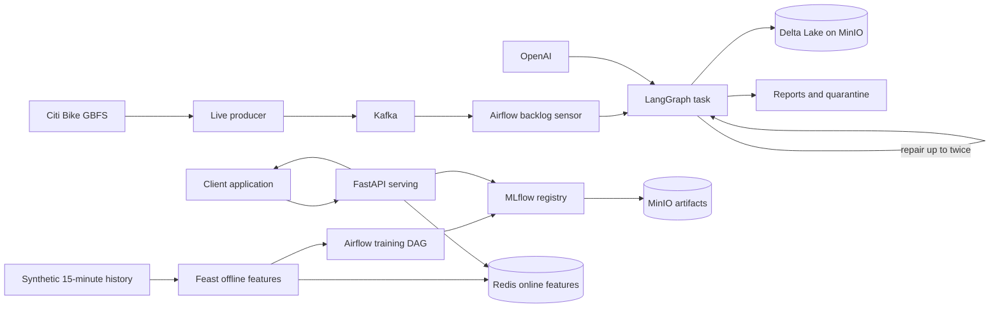

# Citi Bike agentic data and MLOps pipeline

This repository is a local-first, incremental MLOps example. Its first two stages stream
Citi Bike GBFS 2.3 observations through Kafka, run a stateful LangGraph pipeline under
Airflow, and store validated observations and features as Delta Lake tables in MinIO.
OpenAI produces structured transformation plans from the current batch profile and validation results.
Stage 3 adds Feast feature materialization and an MLflow training and registry workflow.
Stage 4 serves the approved model through FastAPI using Feast online features.



The model predicts available bikes 15 minutes ahead. Statistical drift monitoring remains a
later stage.

## Components

- Kafka carries `bike.station_status.v1` events keyed by station ID.
- Airflow schedules one bounded batch each minute. Its rescheduling sensor checks Kafka
  watermarks and committed offsets without consuming messages.
- LangGraph executes scout, profiler, planner, executor, validator, and persist
  nodes. Invalid plans loop back to the planner at most twice.
- Deterministic tools perform transformations; the model cannot execute generated code.
- MinIO stores raw snapshots, Delta tables, quarantine records, and run reports.
- PostgreSQL stores Airflow metadata. `LocalExecutor` keeps the local stack small.
- Feast performs point-in-time joins from Parquet and materializes current features to Redis.
- MLflow tracks experiments, stores artifacts in MinIO, and manages `candidate` and
  `champion` model aliases.
- FastAPI loads the MLflow champion and retrieves inference features from Feast/Redis.

## Local Python setup

Python 3.11 or newer and `uv` are required:

```powershell
uv sync --locked
Copy-Item .env.example .env
```

Put `OPENAI_API_KEY` in `.env`. The default model is `gpt-4.1-mini` and can be changed
with `BIKE_OPENAI_MODEL`. Do not commit `.env`.

The offline fixture path remains available and requires neither Docker nor OpenAI:

```powershell
uv run bikepipe demo
uv run pytest -q
```

It produces one valid station and quarantines one inactive station under `data/batches`.

## Run the complete pipeline with one command

With Docker Desktop running and `OPENAI_API_KEY` set in `.env`, execute the complete local
Kafka, Airflow, LangGraph, OpenAI, MinIO, and Delta path:

```powershell
uv run python main.py
```

The launcher starts the Compose services, creates an isolated Kafka topic and consumer group,
publishes `fixtures/stations.json`, triggers the Airflow DAG, waits for completion, and prints
the final report. It leaves the services running so their state can be inspected afterward.

To exercise the same infrastructure without an OpenAI call:

```powershell
uv run python main.py --fixture
```

Use `--snapshot <path>` for another GBFS snapshot and `--timeout <seconds>` to change the
startup and DAG execution timeout. The lower-level `bikepipe` commands remain available for
running individual stages.

## Start Kafka, MinIO, and Airflow

Start Docker Desktop with Linux containers, then build and start the base services:

```powershell
docker compose up --build -d
docker compose ps
```

Airflow is at http://localhost:8080, MLflow is at http://localhost:5000, and the MinIO
console is at http://localhost:9001.
The Airflow user is `admin`; its generated password is stored in:

```powershell
Get-Content data/airflow/simple_auth_manager_passwords.json.generated
```

The default MinIO login is `minioadmin` / `minioadmin`. Change the corresponding values in
`.env` if the stack is reachable outside your machine. Compose creates the `bike-lake`
bucket automatically.

The `bike_station_pipeline` DAG is enabled on a one-minute schedule. With no Kafka backlog,
the sensor reschedules and the run ends as skipped without calling OpenAI.

## Send data through the pipeline

For a deterministic two-event Kafka replay from the host:

```powershell
uv run bikepipe replay fixtures/stations.json
```

Airflow detects the backlog and executes the LangGraph task with OpenAI planning. To stream
the live Citi Bike feed continuously, start the optional producer profile:

```powershell
docker compose --profile live up --build -d bike-producer
docker compose logs -f bike-producer
```

The producer respects the larger of the configured polling interval and the GBFS feed TTL,
records each raw snapshot locally, uploads it to MinIO, and publishes acknowledged Kafka
events. Stop only the live producer with:

```powershell
docker compose --profile live stop bike-producer
```

Inspect Airflow task logs in the UI or with `docker compose logs airflow-scheduler`.

## Train and register the Stage 3 model

The training path is intentionally separate from the ingestion launcher. Trigger its manual
Airflow DAG after the Compose stack is healthy:

```powershell
docker compose exec airflow-scheduler airflow dags trigger bike_model_training
```

The DAG performs three bounded tasks:

1. It writes 30 days of explicitly synthetic, seeded, eight-station history at 15-minute
   intervals to `data/feast/station_features_history.parquet`.
2. It applies the definitions in `feature_repo`, materializes the latest feature values
   into Redis, and verifies an online lookup.
3. It retrieves point-in-time training features through Feast, uses chronological
   70%/15%/15% train/validation/test windows, and trains a histogram gradient boosting
   regressor.

The persistence baseline predicts that the bike count in 15 minutes equals the current count.
Every successful run is registered as `bike-availability-15m@candidate`. A version becomes
`@champion` only when its validation MAE is strictly lower than that baseline.

Follow the run in Airflow, then open MLflow at http://localhost:5000 to inspect parameters,
metrics, the training summary, artifacts, model versions, and aliases. A compact local report
is also written to `data/training/<mlflow-run-id>.json`.

To verify Redis directly:

```powershell
docker compose exec redis redis-cli DBSIZE
```

Synthetic history is demo training input and is never written into the collected GBFS raw or
Delta observation tables. The Feast source can later be replaced by an event-time export from
the Delta feature table without changing the model-facing feature names.

## Serve predictions with FastAPI

Train and promote a champion model first, then start the optional serving profile:

```powershell
docker compose --profile serving up --build -d bike-api
curl.exe http://localhost:8000/health
```

The API loads `models:/bike-availability-15m@champion` once when it starts. Restart
`bike-api` after promoting a new champion.

Request a prediction using only a station ID. The service obtains all model inputs from the
Feast online store:

```powershell
$body = @{ station_id = 'demo-station-001' } | ConvertTo-Json
Invoke-RestMethod -Method Post -Uri 'http://localhost:8000/predict' -ContentType 'application/json' -Body $body
```

The response includes the raw model output, a rounded prediction bounded between zero and
station capacity, the current bike count, the 15-minute horizon, and the loaded model version.
Interactive OpenAPI documentation is available at http://localhost:8000/docs.

## Inspect MinIO and Delta Lake

The host CLI defaults to local storage so `demo` stays self-contained. Temporarily select
the Delta backend when inspecting the running stack:

```powershell
$env:BIKE_STORAGE_BACKEND = 'delta'
uv run bikepipe verify-storage
uv run bikepipe inspect-lake
Remove-Item Env:BIKE_STORAGE_BACKEND
```

MinIO contains these logical locations:

```text
s3://bike-lake/raw/gbfs/                         raw source snapshots
s3://bike-lake/delta/station_observations       validated Delta table
s3://bike-lake/delta/station_features           feature Delta table
s3://bike-lake/audit/runs/<batch-id>/            quarantine and report JSON
```

Each local `data/batches/<batch-id>` directory still contains `observations.parquet`,
`features.parquet`, `quarantine.json`, and `report.json`. Reports include Kafka offset ranges,
quality results, the selected plan, Delta versions, and object URIs.

## Reliability model

Processing is at-least-once. A pending manifest freezes each batch's partition/offset range.
Delta tables upsert by stable `event_id`, so task retries do not duplicate rows. Raw and audit
objects use deterministic keys. The local completion marker is written only after all MinIO
and Delta operations succeed, and Kafka offsets are committed only after that marker exists.

Airflow limits the DAG to one active run. The MinIO Delta client also uses conditional writes.
Run only one consumer for a given group and shared `data` directory. Across-batch queries use
`event_id` as their identity; later feature jobs will use event time rather than ingestion time.

## Tests

Run fast tests and lint locally:

```powershell
uv run pytest -q
uv run ruff check .
```

With Kafka and MinIO running, execute the opt-in ingestion stack test:

```powershell
$env:BIKE_TEST_STACK = '1'
uv run pytest -q -m "integration and minio"
Remove-Item Env:BIKE_TEST_STACK
```

Validate Airflow DAG imports inside its actual image:

```powershell
docker compose exec airflow-scheduler airflow dags list-import-errors
```

After triggering Stage 3, its concrete integration checks are visible in the task logs:
the Feast materialization task returns a non-null online feature sample, and the training task
returns the MLflow run ID, model version, metrics, and promotion decision.

## Configuration

All application settings use the `BIKE_` prefix and are listed in `.env.example`. Host
defaults use `localhost`; Compose overrides Kafka, MinIO, Redis, Feast paths, and MLflow
endpoints with container paths and service names.
The Airflow image contains the application, while DAGs, logs, and the local recovery directory
are mounted from the repository.

## Shutdown and reset

Stop containers while retaining Kafka, MinIO, and PostgreSQL volumes:

```powershell
docker compose --profile live down
```

To erase this demo's container state, use `docker compose --profile live down -v`. Remove the
project's `data` directory separately only when you also intend to discard pending batch
recovery state. Do not reuse a pending manifest after resetting Kafka.

## Next stages

1. Quality/drift monitoring.
2. Kafka prediction audit events.

Citi Bike discovery feed: https://gbfs.citibikenyc.com/gbfs/2.3/gbfs.json  
GBFS reference: https://gbfs.org/documentation/reference/  
OpenAI structured outputs: https://developers.openai.com/api/docs/guides/structured-outputs
