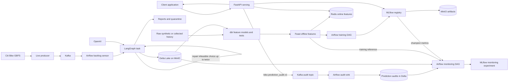

# Citi Bike agentic data and MLOps pipeline

This repository is a local-first, incremental MLOps example. Its first two stages stream
Citi Bike GBFS 2.3 observations through Kafka, run a stateful LangGraph pipeline under
Airflow, and store validated observations as a Delta Lake table in MinIO.
OpenAI chooses two bounded transformation policies from the batch profile: whether to
recognize a known bike-count alias and whether to allow a 15-minute freshness grace period.
Stage 3 uses dbt and DuckDB to build and test feature history, then adds Feast feature
materialization and an MLflow training and registry workflow.
Stage 4 serves the approved model through FastAPI using Feast online features.
Stage 5 records prediction audits in Delta Lake and runs hourly quality, drift, and delayed-label
performance monitoring, with results tracked in MLflow.


```mermaid
flowchart LR
    GBFS[Citi Bike GBFS] --> Producer[Live producer]
    Producer --> Kafka[Kafka]
    Kafka --> Sensor[Airflow backlog sensor]
    Sensor --> Graph[LangGraph task]
    OpenAI --> Graph
    Graph -->|repair infeasible choice up to twice| Graph
    Graph --> Delta[(Delta Lake on MinIO)]
    Graph --> Audit[Reports and quarantine]
    History[Raw synthetic or collected history] --> dbt[dbt feature models and tests]
    Delta --> dbt
    dbt --> Feast[Feast offline features]
    Feast --> Training[Airflow training DAG]
    Training --> Registry[MLflow registry]
    Feast --> Redis[(Redis online features)]
    Registry --> Artifacts[(MinIO artifacts)]
    Client[Client application] --> API[FastAPI serving]
    API --> Redis
    API --> Registry
    API --> Client
    API -->|bike.prediction_audit.v1| AuditKafka[Kafka audit topic]
    AuditKafka --> AuditSink[Airflow audit sink]
    AuditSink --> AuditDelta[(Prediction audits in Delta)]
    AuditDelta --> Monitor[Airflow monitoring DAG]
    Delta --> Monitor
    Feast -->|training reference| Monitor
    Registry -->|champion metrics| Monitor
    Monitor --> Monitoring[MLflow monitoring experiment]
```

The model predicts available bikes 15 minutes ahead. Monitoring joins each mature prediction
to the nearest validated station observation within the configured tolerance. Delta Lake is the
event-level source of truth; Airflow computes the checks; MLflow stores metrics and reports.

## Components

- Kafka carries `bike.station_status.v1` events keyed by station ID.
- Airflow schedules one bounded batch each minute. Its rescheduling sensor checks Kafka
  watermarks and committed offsets without consuming messages.
- LangGraph executes scout, profiler, planner, executor, validator, and persist
  nodes. Infeasible policy choices loop back to the planner at most twice.
- Deterministic tools apply the chosen policies; the model cannot execute generated code
  or alter the fixed station validation rules.
- MinIO stores raw snapshots, Delta tables, quarantine records, and run reports.
- dbt-duckdb derives time features and exact 15-minute labels, tests the resulting dataset,
  and writes the Parquet artifact consumed by Feast.
- PostgreSQL stores Airflow metadata. `LocalExecutor` keeps the local stack small.
- Feast performs point-in-time joins from Parquet and materializes current features to Redis.
- MLflow tracks experiments, stores artifacts in MinIO, and manages `candidate` and
  `champion` model aliases. A separate experiment stores production monitoring windows.
- FastAPI loads the MLflow champion, retrieves inference features from Feast/Redis, and emits
  best-effort versioned prediction audits without making Kafka delivery part of response latency.
- The prediction-audit DAG idempotently persists Kafka events to Delta before committing offsets.
- The hourly monitoring DAG records feature and prediction PSI, input quality, label coverage,
  MAE, RMSE, and persistence-baseline performance. Critical failures fail the Airflow task but
  never move the `champion` alias automatically.

## Quick start

Python 3.11+, `uv`, and Docker Desktop are required. Install the project and create the local
environment file:

```powershell
uv sync --locked --extra dbt
Copy-Item .env.example .env
```

Add `OPENAI_API_KEY` to `.env`, then run the complete local pipeline:

```powershell
uv run python main.py
```

For a deterministic run without an OpenAI call:

```powershell
uv run python main.py --fixture
```

Use `uv run python main.py --help` for launcher options. All application settings and defaults
are listed in `.env.example`.

## Quality and drift monitoring

The audit DAG persists prediction events every minute, and the monitoring DAG evaluates them
hourly against delayed observations and the training reference. Results appear in the
`bike-availability-monitoring` MLflow experiment. Monitoring is advisory; changing the
registered model's `champion` alias remains a manual decision.

Citi Bike discovery feed: https://gbfs.citibikenyc.com/gbfs/2.3/gbfs.json  
GBFS reference: https://gbfs.org/documentation/reference/  
OpenAI structured outputs: https://developers.openai.com/api/docs/guides/structured-outputs
